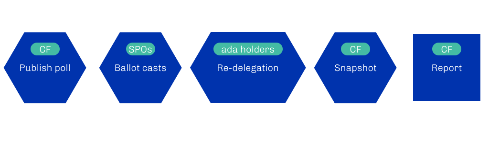

# Entering Voltaire onchain poll for SPOs

## Cardano Forum



## Text

The advent of Voltaire heralds the transition to a fully decentralized, self-sustaining network, where those maintaining the infrastructure as well as the ones participating on-chain through delegation play a vital role in the decision-making. The Cardano Foundation wants to ensure that, in true Voltaire fashion, the various involved parties have a voice in the process.

As a first step, we invite all stake pool operators (SPOs) to take part in an on-chain poll experiment that will help shape the future of Cardano.

The infrastructure introduced during Shelley created the basis for decentralization, putting in place a delegation and incentives scheme that encourages participation while also installing a mechanism to deter dishonest behavior. Someone wishing to contribute to the chain without having to perform technical duties, can do it by delegating their funds to a stake pool of their own choosing. In turn, the SPOs operating the stake pools both validate and process transactions, plus produce new blocks.

A proof-of-stake blockchain relies on this symbiosis between delegators and SPOs. The rewards that a stake pool can receive when randomly selected to create a new block in the chain, will also be distributed among the delegators to that pool. The bigger the combined stake held by the stake pool, the greater the likelihood of the proof-of-stake algorithm picking that stake pool. If an SPO behaves incorrectly or the delegators dislike the SPO’s attitudes or goals, they can withdraw their stake, weakening the SPO’s on-chain influence. In this way, Shelley established the conditions for a governance system with checks and balances, one that distributes power. It fosters democracy.

The network has now reached a state where it can be maintained and improved using decentralized governance mechanisms. As the ecosystem moves towards a more robust and direct participation, it becomes crucial to hear from as many people as possible. Different experiences not only contribute to diversity but also bring forth perspectives and concerns that might otherwise escape attention. Taking them into account will strengthen the ecosystem’s resilience.

Similarly, we as an extended community should not decide to update governance parameters without first engaging in open discussions and adopting Voltaire-minded mechanisms. In fact, the Cardano Foundation wishes to make it easier for the Cardano community to have a say in the development of network updates, technical improvements, and the future of the ecosystem as a whole. Crucially, the Foundation looks to do so by offering a transparent, on-chain method.

The on-chain poll follows this approach, and indeed builds on the mechanism proposed by the Foundation in [CIP-0094 5](https://github.com/cardano-foundation/CIPs/pull/496). The poll will ask SPOs for their stake-weighted opinion on potential changes to parameters and values, giving the Foundation valuable insights into what the community needs as well as its preferences. It likewise applies action 7 of the governance actions detailed in [CIP-1694 1](https://github.com/JaredCorduan/CIPs/blob/voltaire-v1/CIP-1694/README.md).

When the complete implementation of Voltaire happens, polls will be put to the consideration of delegated representatives (DReps), who will have an influence proportional to the amount of support they receive through delegation. Binding votes will also complement the polls, allowing the Cardano community to make important decisions on various proposals. The Foundation’s on-chain poll for SPOs aims to take a step in this direction, testing the system and ensuring it is calibrated for forming robust proposals.

To account for the novelty of the process, an initial test run in the PreProd Testnet will take place during the first two weeks of May. The testnet phase will help improve the processes and tools, after which period we will move to a mainnet poll scheduled for the second half of May. Before the testnet phase, and again before the mainnet one, the Cardano Foundation will invite the SPOs to dedicated workshops explaining how they can participate in the polls.

The results of this on-chain poll will go back to [IOG 1](https://iohk.io/), [EMURGO 1](https://emurgo.io/), and the Cardano Foundation itself in the form of a recommendation. Setting the experiment like this allows not just to explore a new way of surveying a public opinion, but also to do so on-chain, with complete transparency and entirely verified ballots, while still keeping the experiment within a safe environment.

Once the poll has ended, the Foundation will then carefully evaluate the level of participation as well as the stake weights, with the latter playing an especially critical role. The on-chain nature of the poll will guarantee full transparency, so that stake delegators can see the votes casted by SPOs. Since two epochs will separate the moment in which SPOs vote from the effective stake snapshot, stake delegators will have the opportunity to remove their support and redelegate to a stake pool better aligned with their views, thus effectively influencing the direction of a future voting round.

<figure><figcaption></figcaption></figure>

This model of on-chain polls can increase the resilience of the governance mechanism, while also implementing an additional layer of decentralization that ensures the Cardano ecosystem is truly consensus based.

As the path to Voltaire progresses along, the Cardano Foundation wishes to showcase the benefits of blockchain for effective governance. The on-chain poll for SPOs serves as a crucial step, anticipating the implementation of CIP-1694 and helping us maximize the value of on-chain polls and surveys to best serve the Cardano ecosystem. We hope this experiment will give the Cardano community a chance to explore the thrilling potential of on-chain surveys and encourage any SPO interested in participating in this initiative to [subscribe for updates 9](https://cardanofoundation.org/forms/spo-notification).
