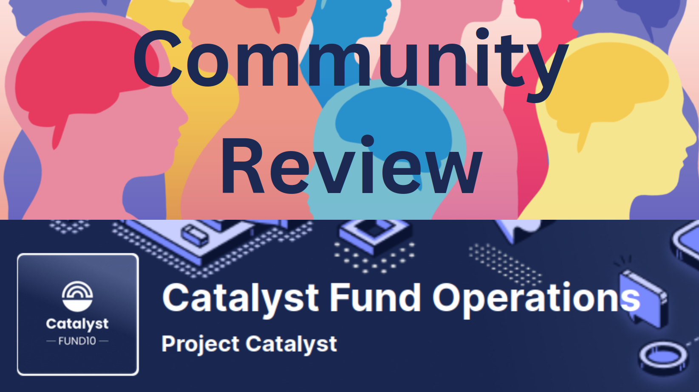

# Community Review of F10 Catalyst Fund Operations

A collaboration between Swarm (https://twitter.com/CatalystSwarm), Governance Guild (https://twitter.com/GovernanceGuild) and QADAO (https://twitter.com/qa\_dao).

## Introduction 

This review of the Fund 10 Catalyst Operations proposal arose from an informal discussion during an After Town Hall breakout room on Wednesday 19th July 2023.

The significance of the proposal was highlighted as well as a need for balanced community discussion and review. It was agreed to compile a review document and collect community feedback.

Swarm Sessions were subsequently held on Saturday 22nd and 29th July 2023. The IOG Catalyst team also held a Community Review & Fund Operations AMA at an After Town Hall on Wednesday 28th July 2023 (See Sources for further details)

This community task was facilitated by Felix Weber and Stephen Whitenstall in collaboration with Swarm, Governance Guild and QADAO.

## The Challenge 

## The Proposal 

[https://cardano.ideascale.com/c/idea/107493/](https://cardano.ideascale.com/c/idea/107493/)

## Community Review 

### Guidelines 

This review will follow the guidelines as published here - [https://docs.projectcatalyst.io/catalyst-basics/how-to-participate-in-community-reviews/community-review-submission-process-lv0-and-lv1/community-review-scoring-rubric-and-guiding-questions](https://docs.projectcatalyst.io/catalyst-basics/how-to-participate-in-community-reviews/community-review-submission-process-lv0-and-lv1/community-review-scoring-rubric-and-guiding-questions)

Any issues out of scope of the guidelines will be highlighted and a rationale provided.

### Sources 

Sources for this community assessment -

#### Catalyst Town Halls 

Community Review & Fund Operations AMA ([Community Review & Fund Operations AMA](https://youtu.be/onwOzMwq2lw))

Kriss Baird (Product Lead, Catalyst) conversations with Nigel Hemsley (VP Governance, IOG) on F10 Catalyst Fund operations category ([Project Catalyst - Weekly Town Hall - #136](https://www.youtube.com/watch?v=IK43DGMF7pM\&t=3226s))

#### Saturday Swarm Sessions 

Community Review of the F10 Catalyst Fund Operations proposal ([Swarm Session - Community Review of the F10 Catalyst Fund Operations proposal](https://youtu.be/T3xT4WOA0QM))

#### IOG posts on Social Media 

This review also sourced selected posts by the IOG Catalyst Team on Social Media including -

**Most important vote in Catalyst**

Response to Patrick Tobler on “Most important vote in Catalyst”

[https://twitter.com/danny\_cryptofay/status/1681606097004638210?s=20](https://twitter.com/danny\_cryptofay/status/1681606097004638210?s=20)

**Importance of Catalyst After Town Halls**

Kriss Baird - Importance of Catalyst After Town Halls - [https://twitter.com/krissbaird/status/1682750043072151553?s=20](https://twitter.com/krissbaird/status/1682750043072151553?s=20)

**Same rules, statement of milestones & deliverables**

Daniel Ribar - Same rules, statement of milestones & deliverables

[https://twitter.com/danny\_cryptofay/status/1682287727209750530?s=20](https://twitter.com/danny\_cryptofay/status/1682287727209750530?s=20)

**Examples of what the Catalyst Team has developed**

Kriss Baird - Examples of what the Catalyst Team has developed since the pause after Project

Catalyst F9

[https://twitter.com/krissbaird/status/1683877550953562114?s=20](https://twitter.com/krissbaird/status/1683877550953562114?s=20)

**Let's replace ideascale**

Daniel Ribar - [https://twitter.com/danny\_cryptofay/status/1683917445893963778?s=20](https://twitter.com/danny\_cryptofay/status/1683917445893963778?s=20)

**Rewarding reviews with micro transactions**

Daniel Ribar - Rewarding reviews with micro transactions

[https://twitter.com/danny\_cryptofay/status/1684533362835193857?s=20](https://twitter.com/danny\_cryptofay/status/1684533362835193857?s=20)

#### Comments on the proposal. 

[https://cardano.ideascale.com/c/idea/107493/comments](https://cardano.ideascale.com/c/idea/107493/comments)

A selection of comments on the proposal

#### Context 

**Co-building the gears of innovation through the relaunch of Project Catalyst with Fund10**

[https://projectcatalyst.io/blog/co-building-the-gears-of-innovation-through-the-relaunch-of-project-catalyst-with-fund10](https://projectcatalyst.io/blog/co-building-the-gears-of-innovation-through-the-relaunch-of-project-catalyst-with-fund10)

### Issue Board 

Issues related to questions and comments raised are being collated on this GitHub Project Board - [https://github.com/orgs/Quality-Assurance-DAO/projects/5/views/1](https://github.com/orgs/Quality-Assurance-DAO/projects/5/views/1) with contextual labels that relate to review categories (Impact, Feasibility & Value for Money) and proposal sub sections.

<figure><figcaption></figcaption></figure>

## Review 

#### Impact 

_Has this project clearly demonstrated in all aspects of the proposal that it will have a positive impact on the Cardano Ecosystem?_

#### Feasibility 

_Is this project feasible based on the proposal submitted? Does the plan and associated budget and milestones look achievable? Does the team have the skills, experience, capability and capacity to complete the project successfully?_

#### Value for Money 

_Is the funding amount requested for this project reasonable and does it provide good Value for Money to the Treasury?_

### &#x20;

## Appendices 

### After Town Hall, July 19, 2023; 

At an informal After Town Hall held on July 19th 2023 the following initial questions and comments were raised -

#### Questions

* Is this proposal a commitment to the next 3 rounds ? Yes
* How will ADA value affect timescales ?
* Why submitted at the last moment even though IOG designed the Challenge ?
* Should the treasury amount be included in the proposal ?
* Who is the Third party they request funds from ?
* Breaking the rules for release of funds per \[category?]
* Community Review perspective - Help Project Catalyst with their proposal
* Good to see some transparency from IOG
* Critical but constructive feedback
* Why has the proposal been communicated that poorly by IOG so far ?

#### Conclusion

Overall, we think that the proposal is indeed an initiative in the right direction towards a more decentrailsed position of the IOG Catalyst team and the project Catalyst at general. Though there seem many uncertainties on the proposal and we want to build understanding and support for the proposal within the Catalyst Community.

### Swarm Session, 22nd July 2023 

At a Swarm Session held on 22nd July 2023 the following initial questions and comments were raised

[https://youtu.be/T3xT4WOA0QM](https://youtu.be/T3xT4WOA0QM)

**Points from the Chat:**

**“Community-led” and co-production**

* I see nothing in the proposal so far for community participation/development. It implies that it’s leading to being more community-led, but that’s a lie. Disingenuous.
* Why make it competitive “winner takes all”, instead of aiming for co-production?
* Turn it into a win-win-win: let IOG win and run Catalyst for one more Fund, but use the money to incentivize the community to co-produce the steps forward together. Catalyst DAO could hire Danny and Kriss to work on the administration part while IOG could just focus on building the tech like all the other developer companies.
* Background: [Gov Workshops 2023](https://docs.google.com/document/d/1F8Hj2tBO8CW1xd9ifV0OA2NFJmV8t-julWNjtCB2xYU/edit?usp=sharing) (_Proposal for a Community Governance Workshop framework_)
* If the proposal is funded, we’ll be locked into this structure for a year - no opportunitiy for completely new community-led approaches to surface
* Time to start breaking down the division between "IOG" and "the community", and start overtly working together on the same level for the same pay.

**Decentralisation**

* Not possible to decentralise Catalyst just like that, with a click of IOG’s fingers. But what they _**could**_ do, is have a clearly _**co-produced**_ and community-capacity-building approach to decentralising. Ask us how, don’t tell us how. Feels as if "decentralising" is something they are doing TO us, not WITH us.
* Could the rush to look like we are decentralizing be connected with the SEC breathing down their necks?

**Oversight**

* Under “legal clarity”: _This agreement will be published online for the Cardano community to see. The Catalyst Funding Vehicle will also be subject to audit oversight, allowing the community to transparently scrutinize all transactions and disbursements carried out by the vehicle_.
* If this [https://cardano.ideascale.com/c/idea/104865](https://cardano.ideascale.com/c/idea/104865) (Community Governance Oversight proposal) gets funded, maybe it can provide a bit of the needed oversight, but it can't do all that needs done
* Assuming the IOG-Catalyst team would subject itself to actual oversight!
* We can be more specfic about transparency questions now.

**Is IOG making proposals the right approach?**

* IOG have created a winner-takes-all challenge, and they say, “we have the experience to be able to run Catalyst”. Is the community going to take a chance on some random other provider? Unlikely. Feels sneaky.
* Which other team can promise 50M ada per fund, going forward? It’s skewing the entire category.
* The bootstrapping argument might appeal to the need for the Principal to set the Challenge.
* IOG have been defensive on Twitter, saying it was well communicated and it’s the community’s fault for not being aware. It’s wrong to pretend that it was fully revealed to the community before the fund closed.
* We shouldn’t give any special handholding to this proposal as opposed to any others in the Challenge.
* I'm all for Hermes and Voices, just hating the way this operations challenge and proposal was bulldozed on us.
* Is this all because IOG no longer want to pay for Catalyst?

**If IOG’s proposal is not funded, what happens?**

* If _**everything**_ in this Challenge is massively downvoted, so they are all “not approved”, does Catalyst disappear, or simply continue on as it is now?
* IOG will override if necessary I think
* Downvote the entire challenge - every proposal - and we can submit our own. Imagine fully funding Treasury Guild and other community groups..!
* Maybe that was the plan: make the community so pissed off that they finally do something. Always handy to have a common enemy.
* Theoretically what would happen is we’d get proposals with very big groups and partnerships
* At least 1% of the total registered stake must vote on a proposal. There is 1 billion ADA as a total registered stake. To be accepted (become an ‘approved proposal’ as well as be eligible for funding), a proposal must be voted by at least 0.01 \* (1 \* 10^9) = 10 millions of ADA.
* Btw: [https://twitter.com/HeptaCardano/status/1682058953159593984](https://twitter.com/HeptaCardano/status/1682058953159593984) (Benjamin Braatz on Twitter raising the point that “_The total votes for this proposal have to be more than 1% of the stake registered to vote. But it is “total votes” – Yes and No – and that is a phenomenally bad idea. Proposals can get funding just because enough people voted \*against\* them. And that happens often_.”)
* Fun fact… voting happens on a private side chain, nobody can check - or only a bit, through voting rewards
* IOG might see not getting voted as support for ending the innovation fund. After all, a large section of ADA holders want this.
* Is it really a "large" section? (not doubting it, just asking)

**IOG’s total F10 ask?**

* Does anyone have the total across all the proposals IOG submitted?
* 3 proposals from IOG [https://www.lidonation.com/en/project-catalyst/users/18936](https://www.lidonation.com/en/project-catalyst/users/18936) 5M requested
* But - total Cost per Fund Period of 4 months: ₳2,140,000. So 3 funds is 3x. So total 9m+ out of community funds - not necessarily right away but wouldn’t it commit 2.1m each time ?

**Replacing Ideascale?**

* Does the "technical infrastructure" budget include a replacement for Ideascale?
* It’s in another IOG proposal: Ideascale replacement and web-browser based Voting Centre with liquid democracy aka “Catalyst Voices” - [https://cardano.ideascale.com/c/idea/107599](https://cardano.ideascale.com/c/idea/107599)
* No, but it includes the costs. A few years ago Ideascale cost 10k per month; now it’s hidden behind all the tool costs. IOG must have got a better deal by now, or the funds they ask would not be enough.

**What’s involved in a fund?**

* It says _**Fund 13 Parameter preparations; Fund13 Launch campaign; Fund13 Proposal Submission stage; Fund13 Community Review; Fund13 Catalyst Voting; Fund13 Voting Tally and Auditable Results; Fund13 Onboarding; Funded-proposal cohort; Fund13 Cooldown & Retrospective**_

The Parameter preparations is a bit of a black box.

**Impact**

* Quoting George Lovegrove’s recent Telegram post on measuring impact: **1)** Doesn’t matter if funded initiatives need to pivot, funding process should allow for flexibility **2)** Impact is what is important, not completion. **3)** Uncompleted initiatives where funding is returned is not a risk for the treasury, contributors should be able to return funds at any point. **4)** Biggest risk for treasuries is completed initiatives not making enough impact. **5)** Effectively measuring impact will help with determining which funding processes are truly effective
* How will this IOG proposal measure its impact?

**CIP-1694 workshops**

* I got ghosted several times when I asked to join Edinburgh meeting. Very unclear process who gets invited.
* Agree: IOG seem to pick and choose.
* Who even is 'the community', and who decides? For me, the _**Catalyst**_ community, people who are engaged with Catalyst, should be the ones who have input into Catalyst. But I'm seeing people saying "the real community is on Twitter..."
* I agree, Cardano Community and Catalyst Community should be distinguished.
* Pre-defining the questions and how we are allowed to answer them, and pre-determining the whole terms of the discussion, was an unfortunate feature of the CIP-1694 workshops.

### Community Review & Fund Operations AMA, After Town Hall, 26th July 2023 

At an After Town Hall held on 26th July 2023 the following questions and answers were raised ..


