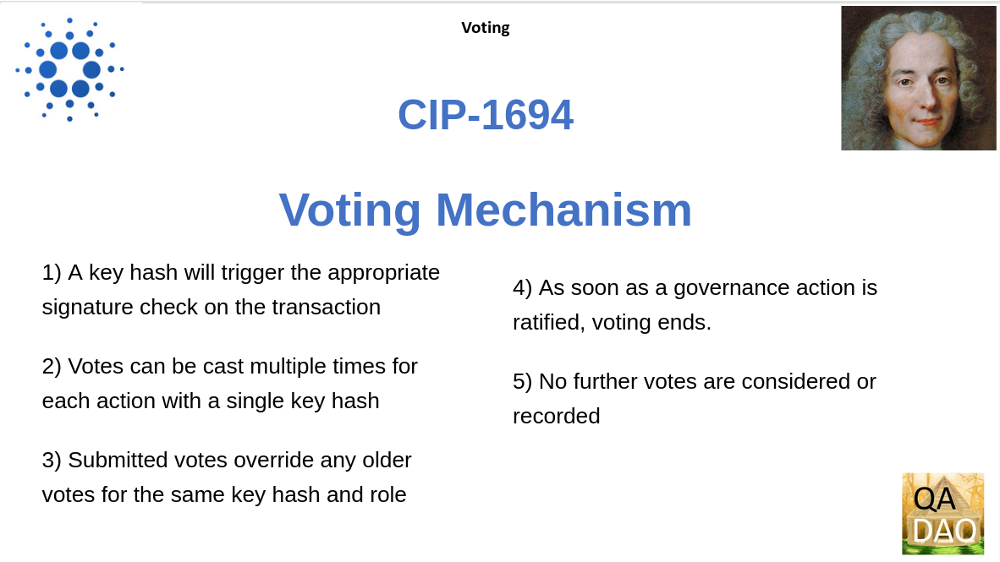
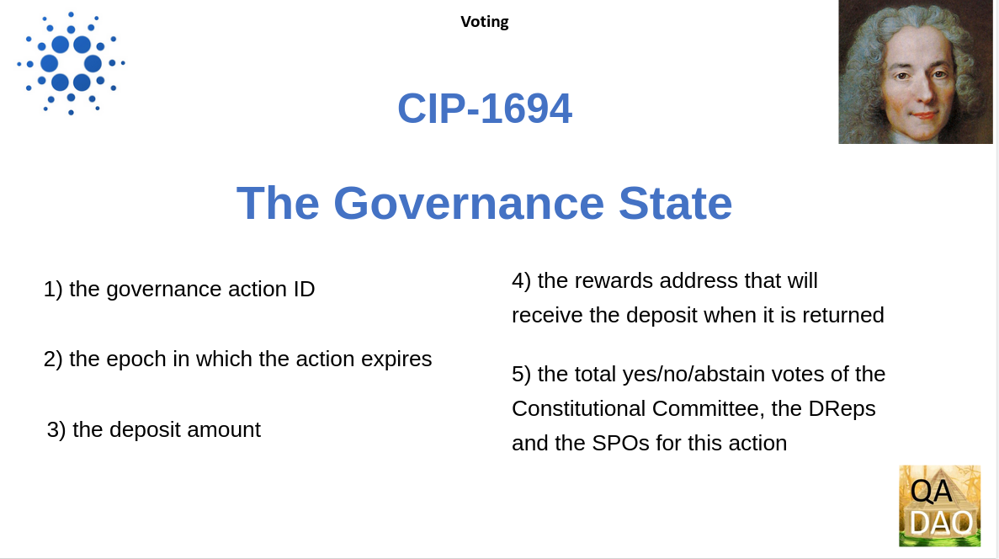
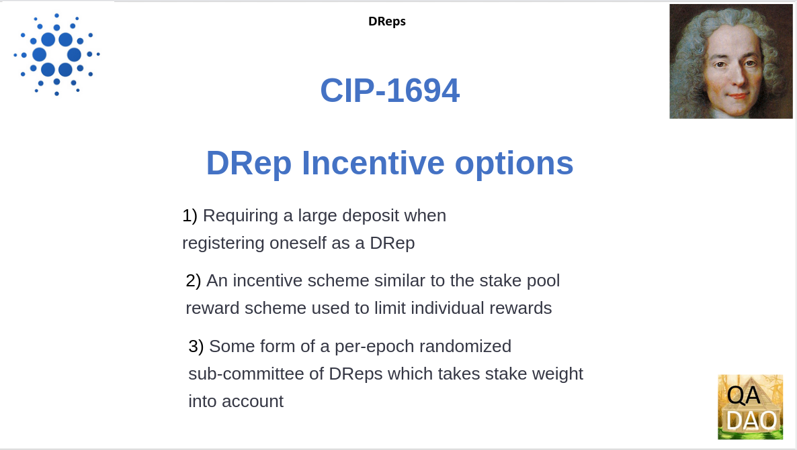

# Voltaire CIP-1694 Specification

## A review of the CIP-1694 Specification 



<figure><figcaption></figcaption></figure>

In order to achieve these ends of greater decentralization and sustainability Input-Output Global has drafted a Cardano Improvement Proposal, CIP 1694, that outlines “An On-Chain Decentralised Governance Mechanism for Voltaire”.

[https://github.com/JaredCorduan/CIPs/blob/voltaire-v1/CIP-1694/README.md](https://github.com/JaredCorduan/CIPs/blob/voltaire-v1/CIP-1694/README.md)

## Draft Specification

<figure><figcaption></figcaption></figure>

The current specification draft (as of February 2023) documents the following :

* The Constitution (a brief outline of intent) and The Constitutional Committee - an overview of the combined governance group and its remit
* Governance Actions - the different types of on-chain events that are governance actions.
* Votes -
* Delegated Representatives (dReps)

## The Constitution and The Constitutional Committee

<figure><figcaption></figcaption></figure>

The Constitution and the Constitution Committee form the heart of the On-Chain Decentralized Governance Mechanism.

### The Constitution

<figure><figcaption></figcaption></figure>

\
The Constitution that will inform and guide the Constitution Committee is kept vague. The Constitution is only referred to as a “an informational document that unambiguously captures the Cardano core values”.

An appendix to CIP-1694 (https://github.com/JaredCorduan/CIPs/blob/voltaire-v1/CIP-1694/README.md#out-of-scope) judges the contents and processes that amend the constitution as very important. However the authors believe these processes are sufficiently separate from the protocol described in CIP-1694 “to merit a separate and focused discussion”.

Elsewhere \[source] an intent to seek out Cardano community values has been expressed. A default would be that the Constitution is decided by the Constitution Committee but this is not specified.&#x20;

The intent to store the Constitution off-chain with only a “hash digest value” or summary of information to be recorded on-chain.&#x20;

“The Digest/Hash function produces a digital summary of information called a message digest. Message digests provide a digital identifier for a digital document. The message digest produced by the Digest/Hash function is Base64 encoded.” See https://www.ibm.com/docs/en/app-connect-pro/7.5.3?topic=reference-digesthash-function&#x20;

### The Constitution Committee

<figure><figcaption></figcaption></figure>

More detail is provided on the Constitution Committee. The Constitutional Committee represents a set of individuals or entities (authenticated by cryptographic signature) responsible for overseeing governance actions and ensuring that the Constitution is respected.&#x20;

#### **Set-up / Initiation**

The first or Initial Constitutional Committee is likely to be composed of founding entities, IOG and the Cardano Foundation together with “key community actors who are interested in participating in the Cardano governance process.”

The extent of share of participation from the founding entities and how community actors are defined as “key” and selected is not specified.

#### **Constitutional Committee States**

<figure><figcaption></figcaption></figure>

The Constitutional Committee has two possible states. One, a normal state (i.e. one of confidence) and Two, a state of no-confidence.

The state of no-confidence is a kind of fail-safe that prevents the current committee from participating in any governance actions. This state voids any outstanding governance actions and requires a committee replacement to continue the work of governance.

The Constitutional Committee will use a hot and cold key setup. A hot key is connected to the blockchain and is live. A cold key is offline and requires manual intervention to initiate.&#x20;

The draft specification states the intention to re-use Cardano’s existing "genesis delegation certificate" mechanism that was introduced at the start of the Shelley era.

See also - https://research.csiro.au/blockchainpatterns/general-patterns/self-sovereign-identity-patterns/hot-and-cold-wallet-storage/

#### **Replacement of the Constitutional Committee**

<figure><figcaption></figcaption></figure>

The Constitutional Committee can be replaced either&#x20;

* through a specific governance action when in a normal state (ie a state of confidence). This requires the approval of the current Constitutional Committee and the DReps.
* Or when a state of no-confidence via a specific governance action that requires the approval of the SPOs and the DReps.

#### **Size of the Constitutional Committee**

<figure><figcaption></figcaption></figure>

“The size of the Constitutional Committee and its quorum (the number of votes that are required to enact governance actions) is not fixed and can be varied whenever a new committee is installed.”

In this context a quorum is a minimum number of votes required to enact governance actions. In general having a quorum helps to ensure that decisions are made with the participation of a representative group of participants, rather than just a small minority. A similar consideration applies to the size of the Constitutional Committee.

## Governance Actions

<figure><figcaption></figcaption></figure>

A governance action is a blockchain parameter (“on-chain event”) triggered by a time-limited transaction (“has a deadline after which it cannot be enacted”).

An action is ratified once it has gathered enough votes to support it. If it fails to gather sufficient yes votes before its deadline the action expires. Or any action may be dropped subsequent to a motion of no confidence. Once ratified an action is “enacted”.&#x20;

<figure><figcaption></figcaption></figure>

The range of governance actions are as follows :&#x20;

* 1\) A Motion of no-confidence creates a state of no-confidence in the current Constitutional Committee causing its dissolution.
* 2\) The size of new Constitutional Committees and/or quorum sizes (or “signature threshold”) may be altered
* 3\) Modifications to the off-chain Constitution recorded on-chain as a hash of the text document
* 4\) A Hard-Fork Initiation triggers a non-backwards compatible upgrade of the network and requires a prior software upgrade
* 5\) Protocol Parameter Changes - Any changes to one or more protocol parameter excluding major protocol versions or "hard forks"
* 6\) Treasury Withdrawals,  sub-categorized into small, medium or large withdrawals (based on the amount of Lovelace to be withdrawn).&#x20;

### Who can submit a Governance Action ?

<figure><figcaption></figcaption></figure>

Any Ada holder can submit a governance action to the chain. A deposit of Lovelace is required, which will be returned when the action is finalized (whether it is ratified, has been dropped, or has expired).

The “motion of no-confidence” action is an extreme measure that enables Ada holders to revoke power granted to the current Constitutional Committee.  If this motion is enacted any outstanding governance actions, including ones that the committee has ratified will be dropped.&#x20;

In the case of other governance actions, voting takes place, followed by ratification or expiry.

## Votes

<figure><figcaption></figcaption></figure>

A vote takes the form of a transaction on the Cardano blockchain. Each vote transaction consists of -

* a governance action ID;
* a role - such as being part of the Constitutional Committee, a DRep, or an SPO;
* a key-hash - which will be verify the role taken;
* a URL that points to any metadata that is relevant to the vote;
* a hash of the contents of the URL;
* a yes/no/abstain vote - abstain in this context is a type of on-chain vote

### Voting Mechanism

<figure><figcaption></figcaption></figure>

The key hash will trigger the appropriate signature check on the transaction body according to the existing UTxOW ledger rule.

Votes can be cast multiple times for each action with a single key hash.&#x20;

Correctly submitted votes override any older votes for the same key hash and role.&#x20;

As soon as a governance action is ratified, voting ends.&#x20;

No further votes are considered or recorded

### Governance State

<figure><figcaption></figcaption></figure>

When a governance action is successfully submitted to the chain, its progress will be tracked by the ledger state. In particular, the following will be tracked:

* the governance action ID;
* the epoch that the action expires;
* the deposit amount;
* the rewards address that will receive the deposit when it is returned;
* the total yes/no/abstain votes of the Constitutional Committee, the DReps or the SPOs for this action.

### **Ledger epochs**

<figure><figcaption></figcaption></figure>

An epoch on the Cardano ledger is a time division that regulates the production of blocks as part of a transaction validation process.

(See also - https://developers.cardano.org/docs/stake-pool-course/introduction-to-cardano/#slots-and-epochs)

### **Stale Votes**

Votes (a vote transaction) from DReps and SPOs may become meaningless as the epoch expiry date is crossed and they become unregistered.  Therefore, all unregistered votes are cancelled before any new votes are considered.

### **Changes to the Stake Snapshot**

The stake snapshot changes at each epoch boundary, therefore a new current voting tally must be calculated for each governance action based on the votes that have been cast before any new votes are counted.&#x20;

This avoids the same stake being used two or more times.

Given the status of the governance state this new tally may result in immediate ratification of a governance action.

## Delegated Representatives (DReps)

<figure><figcaption></figcaption></figure>

“Voltaire” DReps not Project Catalyst dReps

The functionality of Cardano staking will be extended to provide the ability for an ADA holder to delegate their stake to DReps.

<figure><figcaption></figcaption></figure>

DRep Registration will emulate the existing stake delegation mechanisms via a new set of voting certificates.

These will comprise DRep registration and retirement certificates and a Vote delegation certificate. The DRep registration and retirement certificates administer their on-chain identification, information and status.

### **New Stake Distribution for DReps**

<figure><figcaption></figcaption></figure>

A new stake distribution for DReps will determine what ADA (Lovelace) transactions are active for voting, whether DReps have a sufficient active voting stake and whether a vote threshold has been met.

### **DRep incentives**

<figure><figcaption></figcaption></figure>

If DReps are to be compensated for their work corresponding incentive mechanisms will need to be specified with funds coming from the per-epoch treasury allocation.&#x20;

Performance constraints will also need to be considered to moderate the number of DReps voting on each governance action.&#x20;

Some options to ensure a manageable number of DReps include:

1. Requiring a large deposit when registering oneself as a DRep.
2. An incentive scheme similar to the stake pool reward scheme is used to limit individual rewards.
3. Some form of a per-epoch randomized sub-committee of DReps which takes stake weight into account.

## **New Parameter Changes**

<figure><figcaption></figcaption></figure>

New protocol parameters will be needed for the following:

* the governance action deposit amount
* governance action expiration (as a number of epochs from the current epoch)
* thresholds for treasury withdrawals
* each of the ratification thresholds

\

