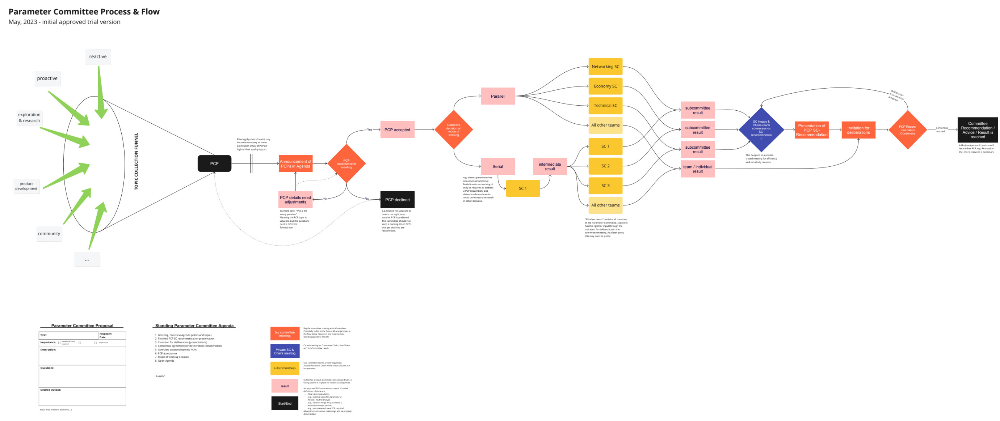

# Voltaire era Parameter Committee

## Cardano Forum



## Text

Cristina\_Echeverry IOHK Team

The Parameter Committee (interim state) meets on a bi-weekly basis. The Parameter Committee discusses all parameters relating to the Cardano protocol including network, technical and economic parameter type. They are a technical advisory group and only make recommendations.

Updated list of the Members (interim state):

**Chairs:**\
Chair: IO Employee\
Vice- chair: Alex Moser (Cardano Foundation)\
Vice- chair: Vijay Bhuvangagiri (Emurgo)

**Advisory Group Heads:**\
Network group: Neil Davies\
Economic group: Markus Gufler\
Technical group: Samuel Leathers

**Advisory Group Members:**\
Network group: Karl Knutson, Matthias Sieber, IO Employee\
Technical group: Ruslan Dudlin, Jared Corduan, Michael Peyton Jones\
Economic group: Sergio Sanchez, Fabian Bormann, Philip Lazos

**Other:**\
Communications: Rebecca Hopwood, Tommy Kammerer, Nathaniel Acton\
Domain experts: WIP\
Secretary: Cristina Echeverry

**Agenda and Updates:**

**Agenda:**

1. Discuss the Processes drafted by the Chair and Vice-Chairs
2. GDPR Compliance and Publication of Updates to the Community
3. Rules of Engagement: Chatham House Rule and Roles of Observers
4. Discuss Proposed Domain experts
5. Other topics: SPO poll updates, communication channel (Discord), other topics open to discussion

**Notes:**

* Processes: Chairs shared the first draft of the process flow for how a parameter committee recommendation on a given topic or question is generated. Anyone, such as the committee itself, the community, product/engineering, research, etc. can initiate the process by requesting a parameter committee proposal (PCP), which will be reviewed collectively, and accepted or declined for the committee to debate in a structured and trackable way. Each proposal should follow the structure of a PCP-template in order to be considered.\
  Note: The process aims to serve as a good-practice framework and does not constitute any obligations, bureaucratically, organisationally or otherwise.

_First version, as of May 2023_

<figure><figcaption></figcaption></figure>

* **GDPR:** Committee members are aware that meeting notes are posted on the Cardano forum, so they also agreed to have their names posted on the forum so that the community is aware of who is providing recommendations for the stability of the Cardano network. This is part of the transparency that the community needs and it is aligned with the future governance of the network.
* **Rules of engagement:** Committee will hold the meetings using the Chatham House Rule, under the Chatham House Rule, anyone who comes to a meeting is free to use information from the discussion, but is not allowed to reveal who made any particular comment. It is designed to increase openness of discussion.
  * Observers will be invited to the committee gradually. Non-permanent experts can be invited by the committee or subcommittees independently, on a case by case basis as needed for any given PCP. Everyone added or invited has to follow the Chatham House Rule.
* **Domain experts discussion:** The list of domain experts was discussed at the meeting, the committee reached consensus on 2 candidates, these candidates will be reached by representatives of the committee and will be invited to join the following meetings.
* **SPO poll updates:** CF shared the updates of the poll, the possible questions that will be asked to the SPOs, the meeting attendees gave recommendations and will follow the poll very closely once it is released. The aim of the poll is to collect relevant opinions from the SPOs.
* **Communications channel:** Discord will be the communication channel for the parameter committee

**Action items:**

* Cristina Echeverry to post meeting notes
* Cristina Echeverry to create discord channel
* Cristina Echeverry & Committee representatives to reach the domain experts and invite them to the next meeting
* Chairs to standardize meeting process & meeting frequency
* Advisory Group Heads to set up their group sync meetings and independent processes
* Chairs to create first PCP for kickoff in the next meeting

**Next agenda (tentative):**

* Welcome to the new joiners
  * Intro of what is the parameter committee: Structure & responsibilities
* Review action points from last meeting:
  * Confirm that everyone joined the main Discord channel
  * Confirm meeting frequency
  * Advisory groups heads to share how they settled their group meetings & processes
  * Kick off of the PCP process with the first proposal.
