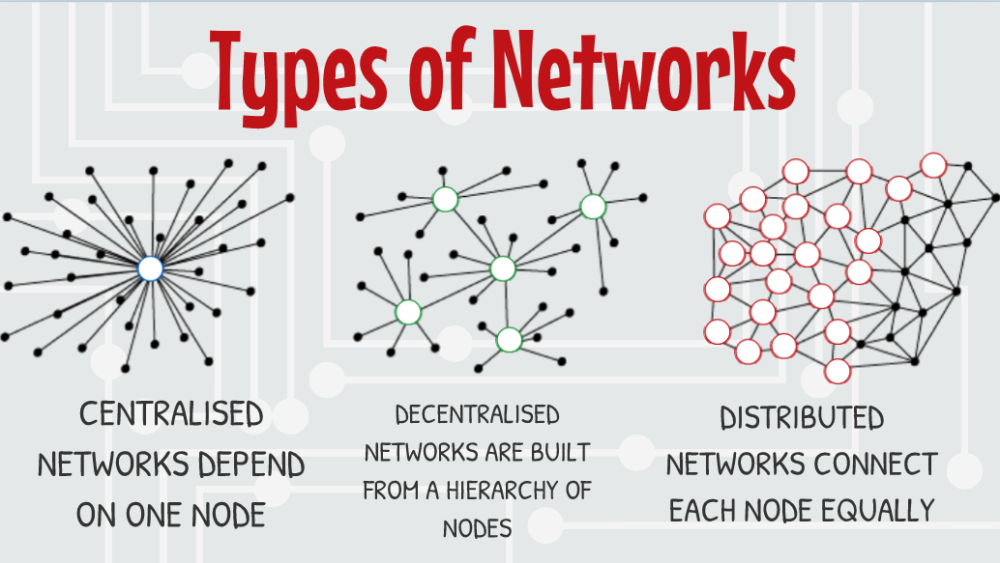

# ABC of Governance - Decentralisation



## ABC of Governance - Decentralisation

&#x20;00:00

## Alexis De Tocqueville on Decentralisation

&#x20;00:06

De Tocqueville believed decentralization was important for democracy, as it allowed individuals to have a greater say in their own government.

> "The efforts of individuals combined with society, achieve what the most energetic administration fails to achieve."&#x20;

He recognized potential pitfalls such as lack of coordination and efficiency.&#x20;

> "How can liberty be upheld in great matters among many who have not learned to make use of it in small ones ?"

## Types of Blockchain Networks

00:45

<figure><figcaption></figcaption></figure>

Blockchain decentralisation is often illustrated by types of network.&#x20;

Centralised networks depend on one node.&#x20;

Decentralised networks are built from a hierarchy of nodes.&#x20;

Distributed networks connect each node equally.

## Vitalik Buterin, "The Meaning of Decentralisation"

01:03

## Architectural decentralisation

01:13

## Political decentralisation

01:26

## Logical decentralisation

01:36

## Decomposition

01:47

## Blockchains - 3 Types of decentralisation

01:59

## How can decentralisation be measured ?

02:19

## Edinburgh Decentralisation Index

02:21

## EDI Decentralisation Layers 1 to 4

02:37

## EDI Decentralisation Layers 5 to 8

03:11

## Decentralisation Pros & Cons

03:46

## How can we overcome these challenges and build a decentralised future?

04:57

## QA-DAO

05:02
