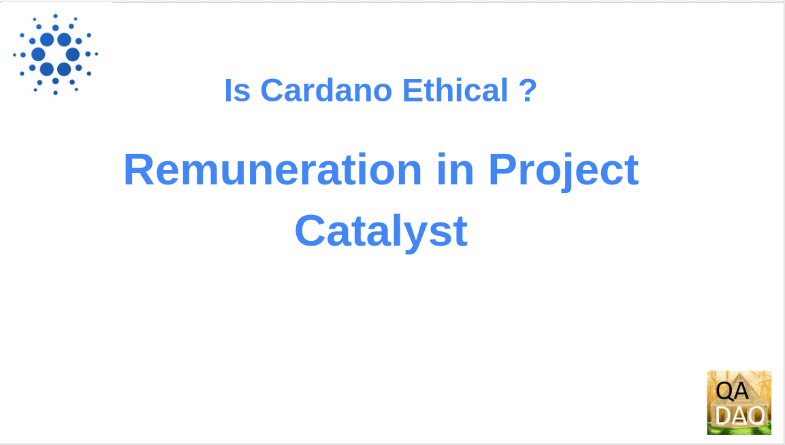

# Is Cardano Ethical ? - Remuneration in Project Catalyst

<figure><figcaption></figcaption></figure>

This presentation by Quality Assurance DAO (QA-DAO) will examine remuneration in Project Catalyst in an ethical context.
