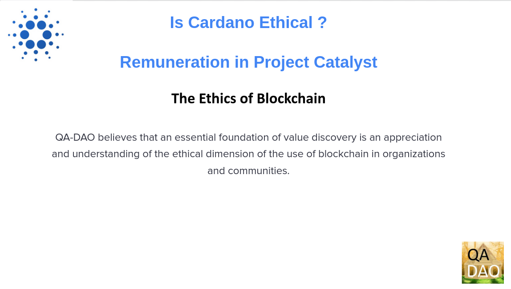

# Is Cardano Ethical ? - Remuneration in Project Catalyst

<figure><figcaption></figcaption></figure>

This presentation by Quality Assurance DAO (QA-DAO) will examine remuneration in Project Catalyst in an ethical context.

## Overview

<figure><figcaption></figcaption></figure>

The proof of stake blockchain Cardano is progressing towards the Voltaire era of its Roadmap ([https://roadmap.cardano.org/en/voltaire/](https://roadmap.cardano.org/en/voltaire/). ). As part of an exercise to establish a constitution the desire to identify community values has been expressed.&#x20;

## The Ethics of Blockchain

<figure><figcaption></figcaption></figure>

QA-DAO believes that an essential foundation of value discovery is an appreciation and understanding of the ethical dimension of the use of blockchain in organizations and communities.&#x20;

Academic work on the ethics of blockchain in organizations is already proceeding. One good overview of the subject can be found in the 2022 paper “The Ethics of Blockchain in Organizations” ([https://link.springer.com/article/10.1007/s10551-022-05058-5](https://link.springer.com/article/10.1007/s10551-022-05058-5)). The 2022 paper examines “Decentralised People Operations” (DPO) and is relevant in this context of Blockchain’s “impact on human interactions and human decision-making in organizations.”

<figure><figcaption></figcaption></figure>

## Project Catalyst

Project Catalyst (https://projectcatalyst.io/) is an initiative started by Cardano in late 2020 it describes itself as “... the world’s largest decentralized innovation engine for solving real-world challenges.”  to fund and research innovation in development, community building etc.

## Remuneration in Project Catalyst

Remuneration refers to compensation or payment made to an individual for their services, time, and efforts in their job or profession. Some commonly express this as “the amount of remuneration should reflect the contribution made”. And others, in blockchain terms, express this as “the token provided should reflect the contribution made”.

In the context of the Cardano blockchain stakeholders and community participants may be remunerated from its Treasury. In past iterations of Project Catalyst this has taken the form of rewarding voters, Proposal Advisors, Referrers and Challenge Teams.

A proposal to transition  the current centralized Treasury management to a more decentralized model is currently in review using the Cardano Improvement Proposal or CIP process. CIP-1694 “An On-Chain Decentralized Governance Mechanism for Voltaire” (https://github.com/JaredCorduan/CIPs/blob/voltaire-v1/CIP-1694/README.md), intends to establish a system of delegated representatives and Stake Pool Operators that will vote on blockchain parameters. These parameters include Treasury management, fund distribution and apportionment.

\
\
\
