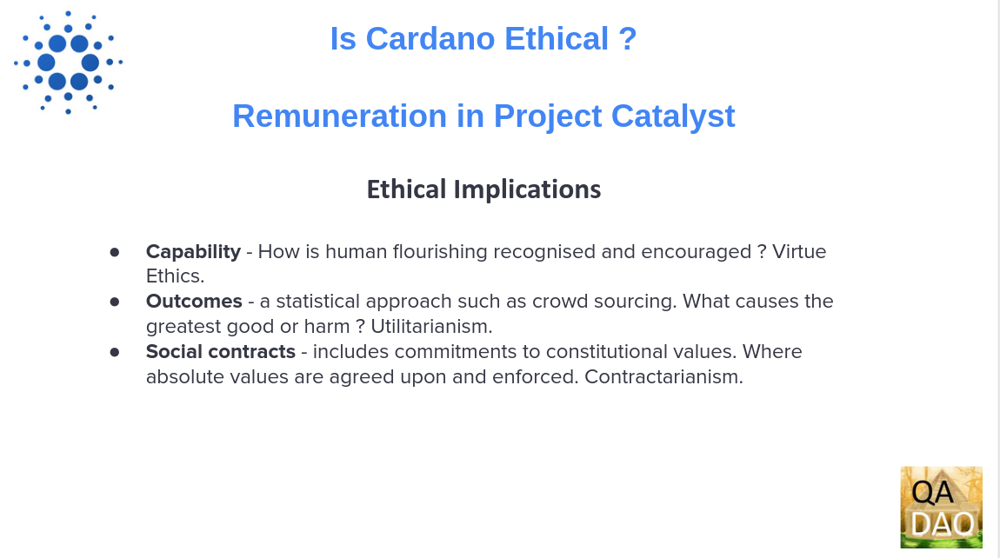
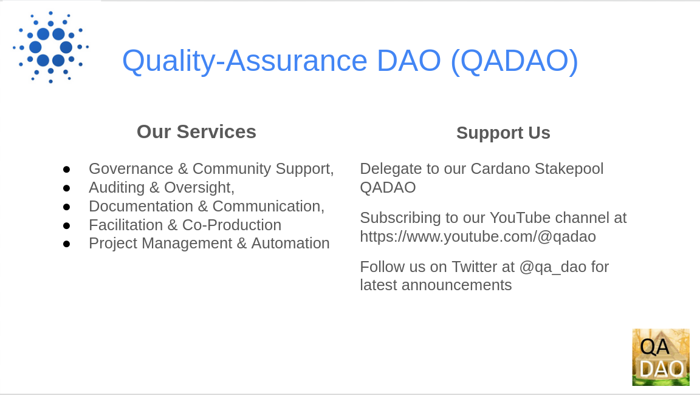

# Is Cardano Ethical ? - Remuneration in Project Catalyst

<figure><figcaption></figcaption></figure>

This presentation by Quality Assurance DAO (QA-DAO) will examine remuneration in Project Catalyst in an ethical context.

## Overview

<figure><figcaption></figcaption></figure>

The proof of stake blockchain Cardano is progressing towards the Voltaire era of its Roadmap ([https://roadmap.cardano.org/en/voltaire/](https://roadmap.cardano.org/en/voltaire/). ). As part of an exercise to establish a constitution the desire to identify community values has been expressed.&#x20;

## The Ethics of Blockchain

<figure><figcaption></figcaption></figure>

QA-DAO believes that an essential foundation of value discovery is an appreciation and understanding of the ethical dimension of the use of blockchain in organizations and communities.&#x20;

Academic work on the ethics of blockchain in organizations is already proceeding. One good overview of the subject can be found in the 2022 paper “The Ethics of Blockchain in Organizations” ([https://link.springer.com/article/10.1007/s10551-022-05058-5](https://link.springer.com/article/10.1007/s10551-022-05058-5)). The 2022 paper examines “Decentralised People Operations” (DPO) and is relevant in this context of Blockchain’s “impact on human interactions and human decision-making in organizations.”

<figure><figcaption></figcaption></figure>

## Project Catalyst

Project Catalyst (https://projectcatalyst.io/) is an initiative started by Cardano in late 2020 it describes itself as “... the world’s largest decentralized innovation engine for solving real-world challenges.”  to fund and research innovation in development, community building etc.

## Remuneration in Project Catalyst

Remuneration refers to compensation or payment made to an individual for their services, time, and efforts in their job or profession. Some commonly express this as “the amount of remuneration should reflect the contribution made”. And others, in blockchain terms, express this as “the token provided should reflect the contribution made”.

In the context of the Cardano blockchain stakeholders and community participants may be remunerated from its Treasury. In past iterations of Project Catalyst this has taken the form of rewarding voters, Proposal Advisors, Referrers and Challenge Teams.

A proposal to transition  the current centralized Treasury management to a more decentralized model is currently in review using the Cardano Improvement Proposal or CIP process. CIP-1694 “An On-Chain Decentralized Governance Mechanism for Voltaire” (https://github.com/JaredCorduan/CIPs/blob/voltaire-v1/CIP-1694/README.md), intends to establish a system of delegated representatives and Stake Pool Operators that will vote on blockchain parameters. These parameters include Treasury management, fund distribution and apportionment.

## Paying Challenge Teams

<figure><figcaption></figcaption></figure>

* To date Challenge Teams are asked to onboard proposers (Proof of Life), present the Challenge at a Town Hall and write a final report.
* At present each Challenge Team receives the same payment amount (or fee) drawn from the Cardano Treasury apportioned to Project Catalyst.&#x20;
* The number of proposals and support needed will vary per Challenge.  Challenge Teams receive the same payment regardless of the number of proposals, the number and experience of Challenge Team members, the amount of support each proposal may need and the scale of the budgets of proposals in the challenge.
* In Fund 9 additional funds were made available for approval of milestones in the dApp Challenge. This is meant to cover review of the Statement of Milestones (SOM) and approvals of Proof of Milestones (POM)

## Factors informing remuneration for Challenge Teams

<figure><figcaption></figcaption></figure>

These factors should inform the overall amount of remuneration for Challenge Teams.

* Number of proposals
* The number and experience of Challenge Team members - the composition, experience and mentorship required in each team.
* The amount of support each proposal may need - the work required to engage with each proposal. Some proposers will be more familiar with the process than others.
* The timing of payments is important to sustain and support participation - A release of payment at each Challenge Team stage (eg onboarding - PoL) would support the people doing the relevant work just completed.
* The scale of the budget and the expected level of scrutiny
* The administrative burden or workload - for example time spent on Proof of Life, Presentations, milestone statements (SOM) and proof of completion (POM)

## Ethical Implications

<figure><figcaption></figcaption></figure>

In the context of decentralized people operations mentioned above, participants being paid for the administration and/or audit of proposals raises issues of trust, accountability and legitimacy that may not be adequately served only by “protocols and algorithms”.

Blockchain has the potential either to continue to treat people as resources or to disrupt this paradigm with decentralized decision making. This includes innovation in deciding levels and share of remuneration. Some factors for assessing the ethical dimension of blockchain governance include -\

**Capability** - How is human flourishing recognised and encouraged ? Virtue Ethics.

**Outcomes** - a statistical approach such as crowd sourcing. What causes the greatest good or harm ? Utilitarianism.

**Social contracts** - includes commitments to constitutional values. Where absolute values are agreed upon and enforced. Contractarianism.

The Who, What, When, Where and Why of any ethical choice or value judgment is a basic minimum of information required to understand each case. (Aristotle's Nicomachean Ethics).

## QADAO

<figure><figcaption></figcaption></figure>

QA-DAO is a community organization that provides the following services :&#x20;

\

* Documentation and Communication,&#x20;
* Auditing and Oversight,&#x20;
* Governance and Community Support,&#x20;
* Facilitation & Co-Production
* and Project Management and Automation

\

You can support our work by delegating to our Cardano Stakepool QADAO, subscribing to our YouTube channel at https://www.youtube.com/@qadao&#x20;

&#x20;and follow us on Twitter at @qa\_dao for the latest announcements.

\
\
\

\
\
\
