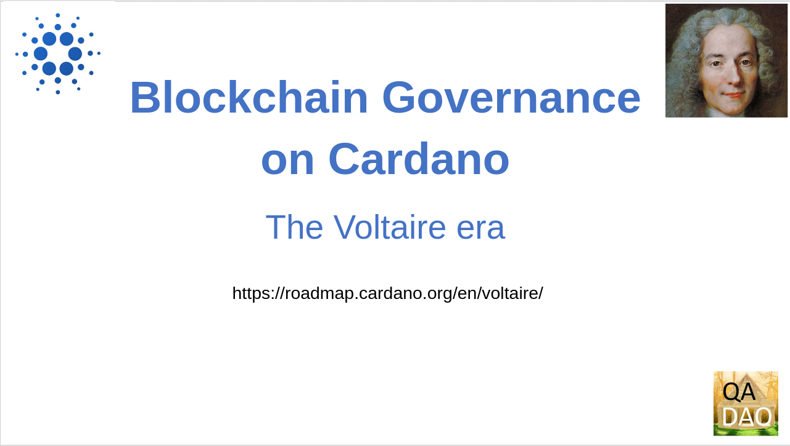
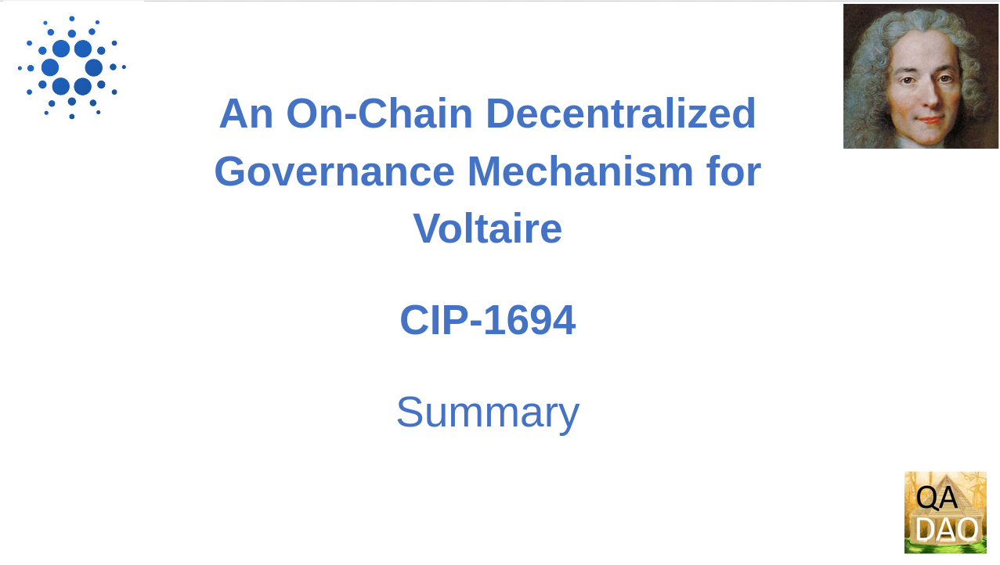
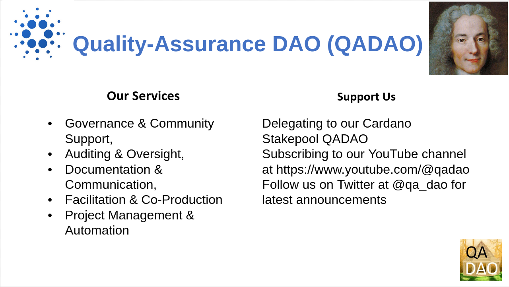
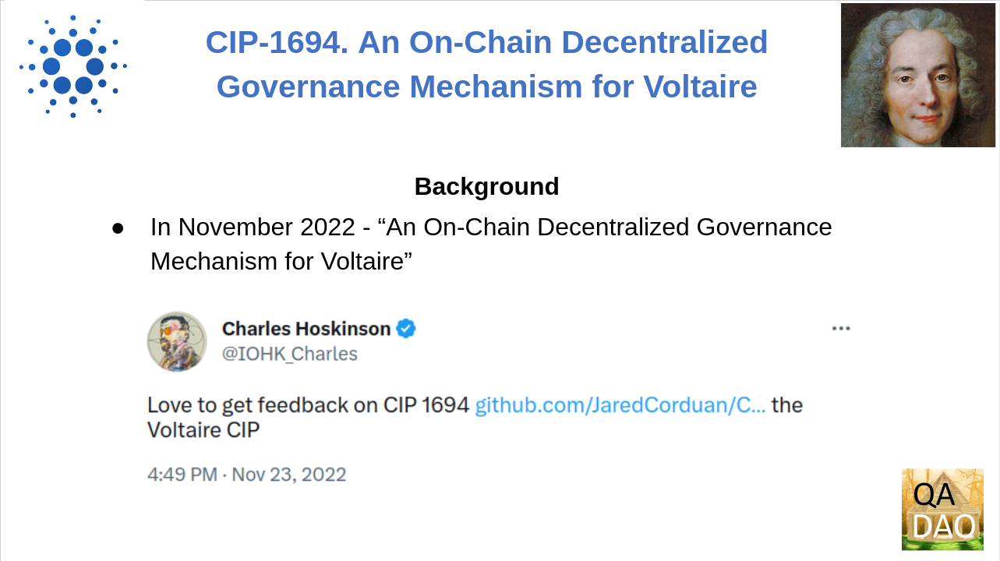
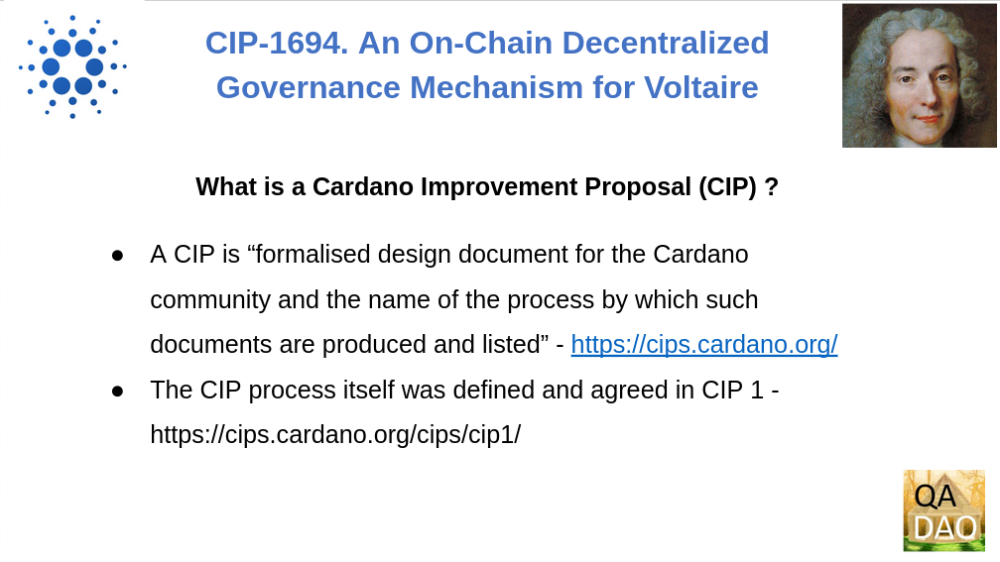
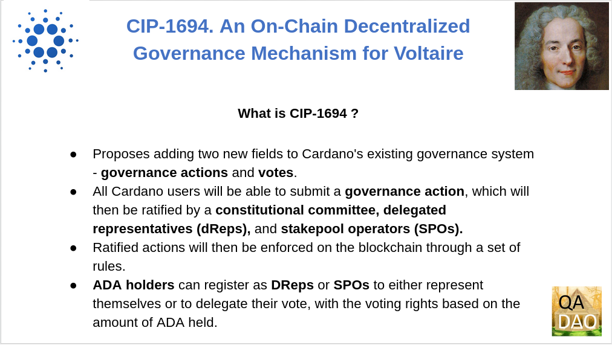

# Voltaire CIP-1694 Summary



<figure><figcaption></figcaption></figure>

Cardano is a blockchain platform and cryptocurrency that was developed to provide a more secure and sustainable infrastructure for decentralized applications and digital assets. It is based on the proof-of-stake consensus algorithm and utilizes smart contracts, which allow developers to build decentralized applications on the platform.

The Voltaire era of Cardano aims to make the network self-sustaining by adding a voting and treasury system. This will allow network participants to use their stake and voting rights to shape the future development of the network.



## Summary

<figure><figcaption></figcaption></figure>

In order to achieve these ends of greater decentralization and sustainability Input-Output Global has drafted a Cardano Improvement Proposal, CIP 1694, that outlines “An On-Chain Decentralised Governance Mechanism for Voltaire”.

This presentation by Quality Assurance DAO (QA-DAO) is a summary of CIP-1694.

### QA-DAO

<figure><figcaption></figcaption></figure>

QA-DAO is a community organization that provides the following services :&#x20;

* Documentation and Communication,&#x20;
* Auditing and Oversight,&#x20;
* Governance and Community Support,&#x20;
* Facilitation & Co-Production
* and Project Management and Automation

You can support our work by delegating to our Cardano Stakepool QADAO, subscribing to our YouTube channel at https://www.youtube.com/@qadao and follow us on Twitter at @qa\_dao for the latest announcements.

### Background

<figure><figcaption></figcaption></figure>

In November 2022 a Cardano Improvement Proposal (CIP) titled “An On-Chain Decentralized Governance Mechanism for Voltaire” was submitted to the Cardano Foundation’s [“CIPS” GitHub Repository](https://github.com/cardano-foundation/CIPs)

From the outset Community Feedback has been sought encouraged by both IOG - [https://twitter.com/IOHK\_Charles/status/1595459431164424195](https://twitter.com/IOHK\_Charles/status/1595459431164424195) and the Cardano Foundation on the Voltaire CIP.

### What is a CIP ? (Cardano Improvement Proposal)

<figure><figcaption></figcaption></figure>

A CIP is “formalised design document for the Cardano community and the name of the process by which such documents are produced and listed” - https://cips.cardano.org/ The CIP process itself was defined and agreed in CIP 1 - https://cips.cardano.org/cips/cip1&#x20;

### What is CIP-1694 ?

<figure><figcaption></figcaption></figure>

In summary the abstract for CIP-1694 proposes a revision of Cardano’s existing governance (the blockchain).&#x20;

Two new fields will be added to on-chain transactions : 1) governance actions and 2) votes.&#x20;

Any Cardano user will be allowed to submit a governance action which will then be ratified by a constitutional committee, delegated representatives (DReps) and Stakepool operators (SPOs).&#x20;

The ratified actions will then be enforced on the blockchain through a set of rules.&#x20;

ADA holders can register as DReps or SPOs to either represent themselves or to delegate their vote, with the voting rights based on the amount of ADA held.
